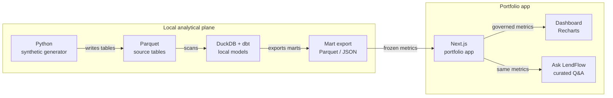

# LendFlow architecture

Phase 1 design. No generator, dbt project, or UI in this repository yet.

## Objective

Show how a senior product analyst would find where an auto-loan application loses qualified applicants, why that happens, and which change to test first.

Thesis: **Approval isn't the finish line. Funding is.**

The case study is fictional and synthetic. It is Not affiliated with any real lender.

## Canonical diagram

Open [docs/diagrams/lendflow-stack.html](diagrams/lendflow-stack.html) for the Archify viewer (themes, search, guided views). Edit either source below, then re-render that HTML with Archify before replacing it. Do not hand-edit the HTML.

- Mermaid: [docs/diagrams/lendflow-stack.mmd](diagrams/lendflow-stack.mmd)
- Archify JSON: [docs/diagrams/lendflow-stack.archify.json](diagrams/lendflow-stack.archify.json)



Guided views in the HTML: the Option A path, then the two consumers of the export.

## Chosen architecture

Owner decision, 2026-09-21: **Option A.**

```text
Python → Parquet → DuckDB + dbt → mart export → Next.js
                                              ├─ Dashboard (Recharts)
                                              └─ Ask LendFlow (curated Q&A)
```

| Stage | Role |
| --- | --- |
| Python | Deterministic synthetic generator. Fixed seed. About 100,000 applications. Later contract. |
| Parquet | Source tables from the [analytical spec](../specs/analytical-spec.md). |
| DuckDB + dbt | Local engine and governed models. `dbt-duckdb`. Zero warehouse cost. |
| Mart export | Frozen facts and metrics. Parquet for facts. A small JSON document for the UI. SQL text for Ask LendFlow sits with that document. |
| Next.js | Portfolio app. Reads the export. Does not query a live warehouse. |
| Dashboard | Overview, Application Funnel, Operations, Experiment. |
| Ask LendFlow | V1 answers are deterministic and curated. Same metrics as the dashboard. Read-only SQL can be shown. A live LLM is out of V1. |

EDA is mandatory before dashboard copy. `data_project: true` on the task contract schedules that work. It is not part of this design package.

Northstar ([ecommerce profitability analytics](https://ecommerce-profitability-analytics.vercel.app/)) is the UX pattern reference: one thesis, an executive overview, KPI cards, trends, analyst signals, one governed metric layer, visible read-only SQL, synthetic data disclosed. Do not copy its content or its section list.

## Trade-offs

- One local metric layer feeds both the dashboard and Ask LendFlow.
- dbt tests are the governance point. The UI does not re-implement metrics.
- There is no warehouse cost. Rebuilds are a local or CI command, still to be written.
- The UI cannot run ad-hoc SQL against DuckDB. Ask LendFlow shows curated questions and the SQL that defines them.
- The export can go stale if a later contract skips the rebuild step. The dbt contract has to make that command the only publish path.

## Alternatives

| ID | Option | Disposition |
| --- | --- | --- |
| A | Python → Parquet → DuckDB + dbt → mart export → Next.js | **Accepted.** |
| B | Same models, but Next.js queries DuckDB at request time or in the browser (DuckDB-WASM) | Not V1. Use it only if a later contract needs live SQL in the demo. Higher deploy friction, same warehouse cost (none). |
| C | Cloud warehouse (BigQuery or Snowflake) plus dbt | **Rejected.** Extra cost, and a non-goal in the frozen brief. |

## Decision log

| Date | Role | Decision |
| --- | --- | --- |
| 2026-09-21 | owner | Brief frozen. Thesis, lifecycle, metric list, experiment name, Northstar as a pattern reference, synthetic data only. See [LENDFLOW_BRIEF.md](../LENDFLOW_BRIEF.md). |
| 2026-09-21 | project-architect | [ADR 0001](adr/0001-lendflow-analytical-stack.md) proposed Options A, B, and C and recommended A. Q1–Q4 left open. |
| 2026-09-21 | owner | GO for the design package. Q1 = A. Q4: `bank_connection_completion_rate` is computed among applications that **start** bank connection. Ask LendFlow V1 = deterministic curated Q&A. Charts = Recharts. Option C rejected. Merge stays with the owner. |
| 2026-09-21 | builder | Design package on `feat/lendflow-design-package`, from main `7ad0041`. Metric formulas are in the analytical spec. Mart export for later contracts: fact tables as Parquet, one JSON metrics document for the UI, SQL text stored with that document. No product code. |

## Open decisions

These do not block the design package. They block later contracts that would pretend to measure them.

1. **SLA hours.** Decision SLA and funding SLA have no numeric threshold. The operations page cannot show attainment until a later contract sets both clocks' limits. Latency distributions can still be compared.
2. **Guardrail margins.** The experiment spec reports guardrail movement with a confidence interval. It does not define a numeric "approximately unchanged" band. Do not mark a guardrail pass or fail until that band exists.
3. **Referred applications.** V1 treats `referred` as a terminal underwriting outcome. EDA may show that referred files need a second decision. Do not add that stage in this contract.
4. **Option B.** Runtime DuckDB stays available if live SQL becomes a showcase requirement, or if a Vercel limit blocks the export path.
5. **Generator parameters.** Seed integer, exact row count, effect sizes, channel names, and `risk_band` levels belong to the generator contract. This package locks the patterns, not the magnitudes.
