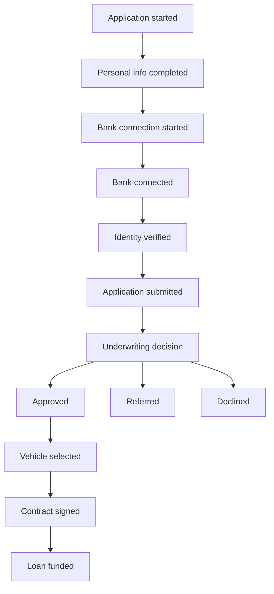

# LendFlow analytical specification

Status: design lock for Phase 1. Date: 2026-09-21. Source: [LENDFLOW_BRIEF.md](../LENDFLOW_BRIEF.md), owner GO the same day.

This document defines grains, metrics, the experiment, and the patterns the generator must seed. It does not contain effect sizes, dashboard sentences, or code. EDA writes the findings. The dashboard repeats those findings. It does not invent them.

Primary grain is the **application** (`application_id`).

## 1. Question

Where does the application journey lose qualified applicants, why does it happen, and what should the product team change?

V1 answers that with five surfaces: Overview, Application Funnel, Operations, Experiment, Ask LendFlow. No other pages until those work end to end.

## 2. Lifecycle

Happy path, in order. Do not add a stage unless it answers a question.



`referred` and `declined` stop the funding path in V1. A referred file does not get a second decision in this spec. That assumption is open to EDA (see architecture open decision 3).

Failure and work events sit inside a stage. They are not extra funnel stages.

| Event | Where it sits |
| --- | --- |
| `bank_connection_failed` | After start, before connected. A later `bank_connected` still counts as completion. |
| `identity_verification_started` | Between bank connected and identity verified. |
| `identity_verification_failed` | Same interval. A later `identity_verified` still counts as success. |
| `underwriting_started` | Between submitted and the decision. |
| `manual_review_started` | Inside underwriting. Sets the manual path. |
| `contract_started` | Between vehicle selected and contract signed. |
| `funding_started` | Between contract signed and loan funded. |

### Clocks

`applications` holds the canonical timestamps `started_at`, `submitted_at`, `decision_at`, `contracted_at`, `funded_at`. The matching event timestamp is that column. `underwriting_decisions.decision_timestamp` equals `decision_at`. Intermediate stages use `event_timestamp` only.

| Application column or decision | Event |
| --- | --- |
| `started_at` | `application_started` |
| `submitted_at` | `application_submitted` |
| `decision_at` and `approved` | `decision_approved` |
| `decision_at` and `referred` | `decision_referred` |
| `decision_at` and `declined` | `decision_declined` |
| `contracted_at` | `contract_signed` |
| `funded_at` | `loan_funded` |

When a stage is reached, timestamps are ordered:

```text
started_at
  ≤ personal_info_completed
  ≤ bank_connection_started
  ≤ bank_connected
  ≤ identity_verified
  ≤ submitted_at
  ≤ decision_at
  ≤ vehicle_selected
  ≤ contracted_at
  ≤ funded_at
```

Null means the stage was not reached. A later non-null timestamp with an earlier null is a data-quality failure.

`application_status` is the furthest state reached:

```text
started
personal_info_completed
bank_connection_started
bank_connected
identity_verified
submitted
approved
referred
declined
vehicle_selected
contracted
funded
```

Funding fields exist only after `approved`. `funded` implies `contracted` implies `approved` implies `submitted` implies `started`.

## 3. Tables

About 100,000 applications. The generator is deterministic from one fixed seed. The seed integer is a generator-contract parameter.

Avoid exact age, exact income, and other sensitive attributes. `risk_band` is a synthetic segment, not a credit model. The generator contract publishes its allowed levels. This spec sets none.

| Table | Grain | Key |
| --- | --- | --- |
| `applicants` | one person | `applicant_id` |
| `applications` | one application | `application_id` |
| `events` | one product event | `event_id` |
| `underwriting_decisions` | one terminal decision | `application_id` |
| `funding_events` | one application that was approved | `application_id` |
| `experiments` | one assignment | (`application_id`, `experiment_name`) |

Column lists are the frozen brief. Additions:

| Column | Rule |
| --- | --- |
| `applications.application_status` | Enum in section 2. |
| `applications.underwriting_path` | `auto` or `manual`. Null until a decision exists. Matches `underwriting_decisions.decision_path`. |
| `applications.experiment_variant` | `control` or `treatment`. Matches `experiments.variant` for `bank_connection_clarity`. |
| `underwriting_decisions.decision` | `approved`, `referred`, or `declined`. |
| `underwriting_decisions.manual_review_flag` | True iff path is `manual`. |
| `underwriting_decisions.decision_duration_minutes` | `decision_timestamp - submitted_at`, in minutes. |
| `funding_events.funding_status` | `funded` or `not_funded`. |
| `funding_events.funding_duration_hours` | For funded loans, `funded_at - contracted_at`, in hours. Null otherwise. |
| `events.event_name` | The event list in the brief. No extras in V1. |
| `events.error_code` | Null on success events. Required on `bank_connection_failed` and `identity_verification_failed`. |

One decision row per decided application. No second decision in V1.

## 4. Metrics

Rates are proportions in `[0, 1]`. Reports also show percentage points. Durations on the funnel are **minutes** unless the name says hours.

An application enters a lifecycle stage when it has that stage's event (or the decision / funding state that corresponds to it).

### Funnel

Denominator of a step conversion is the previous lifecycle stage, except where the table says otherwise. Drop-off rate = 1 − conversion.

| Metric | Numerator | Denominator |
| --- | --- | --- |
| `applications_started` | applications with `application_started` | — |
| `application_completion_rate` | `application_submitted` | started |
| `submitted_applications` | `application_submitted` | — |
| `step_conversion_rate` | reached the next lifecycle stage | reached this stage |
| `step_drop_off_rate` | did not reach the next stage | reached this stage |
| `median_time_to_submit` | — | median of `submitted_at - started_at` in minutes, **among submitted applications** |

After the decision, the next-stage denominator changes:

| Into | Denominator |
| --- | --- |
| `vehicle_selected` | `approved` |
| `contract_signed` | `vehicle_selected` |
| `loan_funded` | `contract_signed` |

`median_step_duration` is the median of `next_stage_time - this_stage_time` in minutes, among applications that reach the next stage. It is a completer duration. It hides slow abandonments. EDA should also look at time-to-last-event for applications that drop.

### Bank connection (experiment grain is locked here)

Owner lock, Q4, 2026-09-21.

Let `S` be applications with `bank_connection_started`. Let `C` be applications with `bank_connected`.

```text
bank_connection_completion_rate = |C ∩ S| / |S|
```

The denominator is applications that **start** bank connection. Applications that never start are outside this metric. They belong to `bank_connection_start_rate`.

| Metric | Numerator | Denominator |
| --- | --- | --- |
| `bank_connection_start_rate` | `S` | `personal_info_completed` |
| `bank_connection_completion_rate` | `C ∩ S` | `S` |
| `bank_connection_failure_incidence` | applications in `S` with at least one `bank_connection_failed` | `S` |

`bank_connection_failed` does not cancel completion. Completion means the application reached `bank_connected`.

`C \ S` is empty in a valid dataset. Those rows fail a test and are in neither the numerator nor the denominator.

The brief's "bank connection success rate" is this completion rate. Do not publish a second definition.

### Identity

| Metric | Numerator | Denominator |
| --- | --- | --- |
| `identity_verification_success_rate` | reached `identity_verified` | `identity_verification_started` |
| `identity_verification_failure_rate` | has `identity_verification_failed` and never `identity_verified` | `identity_verification_started` |

### Underwriting

`decided` = applications with one terminal decision.

| Metric | Numerator | Denominator |
| --- | --- | --- |
| `approval_rate` | `approved` | `decided` |
| `decline_rate` | `declined` | `decided` |
| `referral_rate` | `referred` | `decided` |
| `auto_decision_rate` | `decision_path = auto` | `decided` |
| `manual_review_rate` | `manual_review_flag` | `decided` |
| `median_time_to_decision` | — | median `decision_duration_minutes` among `decided` |
| `decision_sla_attainment` | decided applications within the SLA limit | `decided` |

Identities: `approved + referred + declined = decided`, and `auto + manual = decided`.

The SLA limit is **not set**. Attainment stays unshipped until it is. Compare decision-time distributions by `manual_review_flag` without that limit.

### Funding

| Metric | Numerator | Denominator |
| --- | --- | --- |
| `approved_to_contracted_rate` | `contracted` | `approved` |
| `approved_to_funded_rate` | `funded` | `approved` |
| `contracted_to_funded_rate` | `funded` | `contracted` |
| `funding_rate` | `funded` | `started` |
| `median_time_to_funding` | — | median of `funded_at - decision_at` in hours, among funded loans |
| `funding_sla_attainment` | funded loans with `funding_duration_hours` within the SLA limit | `funded` |

`funding_rate` is the end-to-end thesis metric (funded / started). `approved_to_funded_rate` is the post-approval conversion. Overview shows both, with those names. The funding SLA clock is `funded_at - contracted_at`. Its limit is not set.

### Experience

`error_rate` at a stage = distinct applications with a mapped failure, divided by applications that entered the stage.

| Stage | Failure event |
| --- | --- |
| Bank connection started | `bank_connection_failed` |
| Identity | `identity_verification_failed` |

Other stages have no failure event in V1. Leave the rate null. Do not fill it with zero.

### Segments the funnel must accept

`device_type`, `browser`, `acquisition_channel`, `returning_user`, and time. Applicant bands (`age_band`, `income_band`, `employment_type`, `state`) and synthetic `risk_band` are allowed cuts. They are not required on every chart.

## 5. Experiment

| Item | Lock |
| --- | --- |
| Name | `bank_connection_clarity` |
| Unit | `application_id` |
| When assigned | `application_started` |
| Variants | `control`, `treatment` |
| Rows | one per application |

Every application is assigned. Signals 1–5 must not be implemented by variant. Variant is the only intended cause of signal 6.

**Control.** Current bank-connection experience.

**Treatment.** Shorter copy that explains why bank connection is required and that income verification is meant to be fast. This is not a a fictional auto lender or Plaid interface.

### Estimands

Primary population is `S` (started bank connection), split by variant. This is the owner lock. It is not the full assigned set.

```text
primary = completion_rate(treatment ∩ S) − completion_rate(control ∩ S)
```

Report, by variant: `n_assigned`, `n` in `S`, `n` in `C ∩ S`, the completion rate, and the count assigned but not in `S`.

Secondary, on all assigned applications:

```text
application_submission_rate = submitted / assigned
```

Guardrails, same assigned population, same definitions as section 4:

- `approval_rate` (also report `n_decided`)
- `identity_verification_failure_rate`
- `median_time_to_submit`

Exploratory, not a success criterion: `funding_rate`.

`median_time_to_submit` is conditional on submitting. Read it next to the submission rate.

Applications are treated as independent in V1. A returning applicant can land in both variants. If many applicants have multiple applications, a later contract should cluster by `applicant_id`. This spec does not.

### Statistics

One primary test. No multiplicity correction on that test.

- Absolute change: `p_t − p_c`, in percentage points.
- Relative uplift: `(p_t − p_c) / p_c` when `p_c > 0`.
- Interval: 95% Wald confidence interval on the absolute difference.
- Test: two-sided two-proportion z-test. α = 0.05.
- Also report `n` and conversions by variant.

Guardrails get the same style of estimate and interval. They do not get a pass/fail label until a numeric margin exists.

The dashboard decision is one of `Ship`, `Iterate`, `Do not ship`. It is written from the computed result after EDA. This spec does not choose it. The page must separate the statistical result from the product recommendation.

## 6. Seeded signals

The generator plants these patterns. The dashboard does not hard-code the conclusion. EDA has to be able to find each one without reading the generator.

Magnitudes, channel names, and time windows are generator parameters. They are not locked here.

| ID | Pattern | What EDA should be able to show |
| --- | --- | --- |
| 1 | Mobile Safari completes bank connection materially worse than comparable device/browser pairs, with elevated `bank_connection_failed`. | Funnel → bank-connection drop-off → device → browser → Mobile Safari. |
| 2 | One acquisition channel has high start volume and weak submission conversion, weak approved-to-funded conversion, or both. | Start volume is a poor acquisition KPI. |
| 3 | Manual review is a minority of decisions and a disproportionate share of long decision times. | Where the latency sits. Not a recommendation to automate. |
| 4 | Some period or segment where `approval_rate` rises and funded conversion does not. | Approval is an incomplete KPI. This is the thesis. |
| 5 | A smaller segment with longer identity-verification duration and higher abandonment. | EDA names the dimension. The spec does not. |
| 6 | Treatment improves `bank_connection_completion_rate`. Guardrails stay approximately flat. | The experiment section can support a decision. |

Signal 4 must not be created by unbalancing variants. Signal 6 is the only variant effect intended in this design.

## 7. Surfaces

Each page answers one question. Example analyst sentences in the brief are illustrations. Ship sentences that match EDA.

| Page | Question | Metrics |
| --- | --- | --- |
| Overview | Are we funding the applications we approve? | Starts, `application_completion_rate`, `approval_rate`, `funding_rate`, `median_time_to_decision`. Trend, compact funnel, three signals from EDA. |
| Application Funnel | Where is the avoidable friction? | Step volume, conversion, drop-off, median completer time, error rate. Cuts in section 4. |
| Operations | Where do underwriting and funding wait? | Auto vs manual, decision time, approval→funded, contract→funded, funding time. SLA percents only after the limits exist. |
| Experiment | Did the bank-connection change work, and did it cost us downstream? | Hypothesis, `n`, primary difference, interval, p-value, guardrails, one of Ship / Iterate / Do not ship. |
| Ask LendFlow | Can an analyst ask the governed layer a fixed question? | Section 8. |

Overview headline remains: **Approval isn't the finish line. Funding is.**

## 8. Ask LendFlow

V1 is a fixed catalog. Answers are written after EDA, from the marts, and stored with the export. A live model is out of scope.

Rules:

- Use the metrics in this spec. Do not invent a number.
- Show the read-only SQL for the answer.
- Label interpretation as generated for the demo.
- If the catalog question cannot be answered from the marts, say so.

V1 catalog:

```text
Where do applicants drop off most?
Which segment has the longest underwriting time?
Why did funding conversion decline?
How does manual review affect decision time?
Did the bank-connection experiment improve completion?
Show the funnel for mobile applicants from paid search.
```

"Paid search" is a catalog phrase. If the generator does not use that channel name, the curated answer says the channel is absent. It does not rename the question in secret.

## 9. Later dbt layout

Not built in this contract. Target for the dbt contract:

```text
staging:    stg_applicants, stg_applications, stg_events,
            stg_underwriting_decisions, stg_funding_events, stg_experiments
intermediate: int_application_funnel, int_application_durations,
              int_experiment_assignments
marts:      fct_applications, fct_application_funnel, fct_underwriting,
            fct_funding, fct_experiment_results, product_metrics
```

`product_metrics` is the only metric definition the UI and Ask LendFlow read. Funnel facts and `product_metrics` must reconcile on starts, submissions, approvals, and funded counts.

## 10. Tests the dbt contract must include

Prefer these checks over a long list of weak ones.

- `application_id` unique on applications, decisions, funding, and experiment assignment.
- Every application has one applicant. Every event application exists.
- Timestamp order in section 2. No funding before approval. No contract before submission.
- Variant in {`control`, `treatment`}. One assignment per application for `bank_connection_clarity`.
- Status and event names belong to the sets in this spec.
- `bank_connected` implies `bank_connection_started`.
- `decision_duration_minutes` matches the timestamp delta.
- Stage counts match between `fct_application_funnel` and `fct_applications`.

## 11. Non-goals

Out of V1, and out of this design pull request:

- Data generator, Parquet files, dbt models, Next.js app, dashboard UI.
- Airflow, Dagster, Kafka, GCP, BigQuery, Snowflake, Databricks, Kubernetes.
- Production ML, real credit scoring, real applicant data, real a fictional auto lender data.
- Authentication, multi-user permissions, production LLM infrastructure.
- Live DuckDB in the browser or on the server (Option B).
- Cloning the Northstar ecommerce narrative.
- Any work on Barrilito or vaca-muerta-pulse.

Portfolio value is the product question, the metric layer, the experiment, and the write-up.

## 12. Success criteria

A reviewer can follow this in about five minutes:

```text
Problem → metric → funnel → deep dive → insight → hypothesis → experiment → decision
```

They can answer: what problem, where the funnel breaks, why, the business impact, what to change, and how that change was tested.

## 13. What EDA may overturn

Stage list, the terminal treatment of `referred`, and any seeded pattern that is not actually visible. EDA may not change the primary metric's denominator: applications that start bank connection. Changing that requires a new owner decision.
